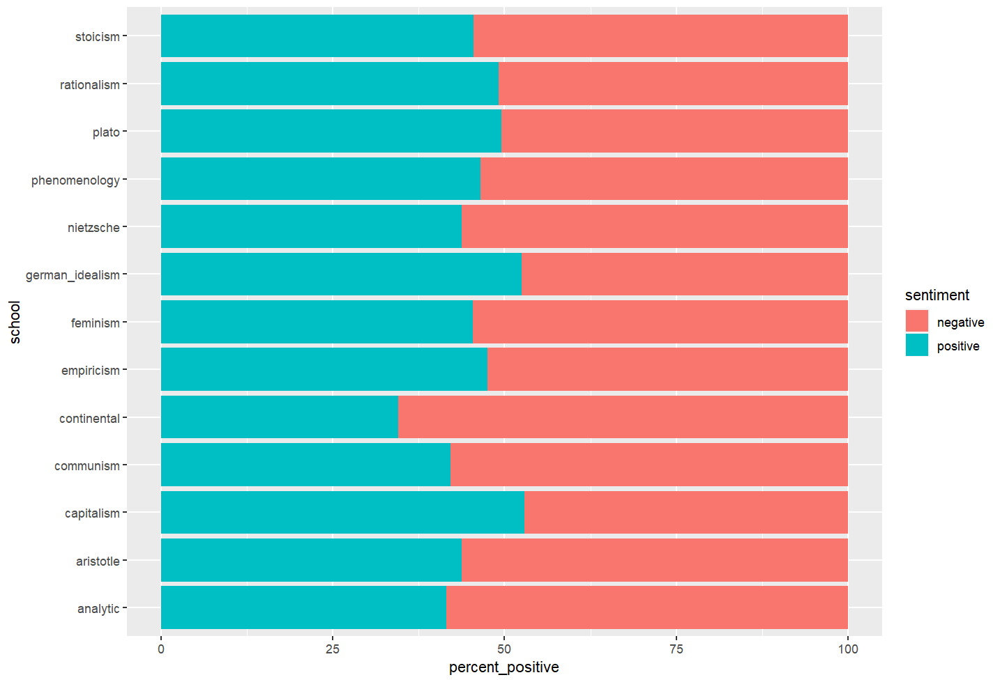
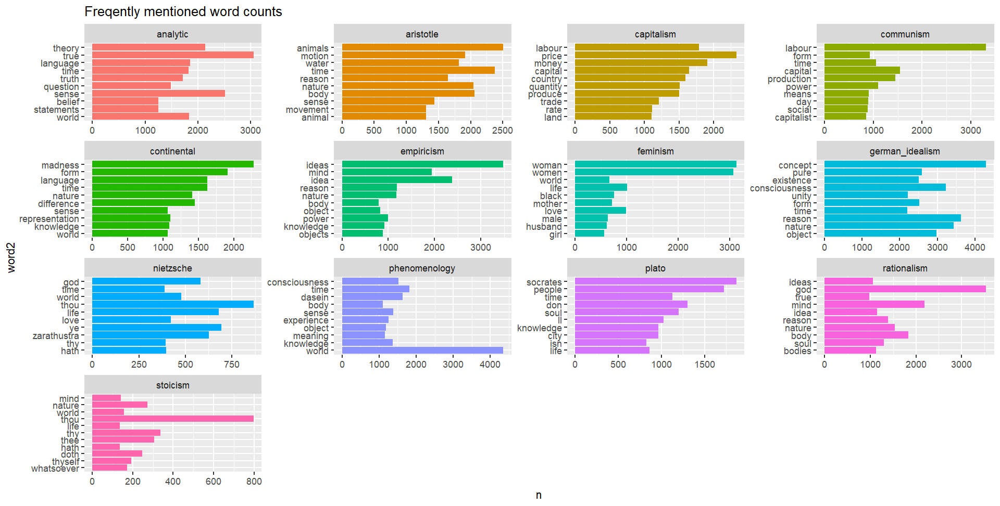
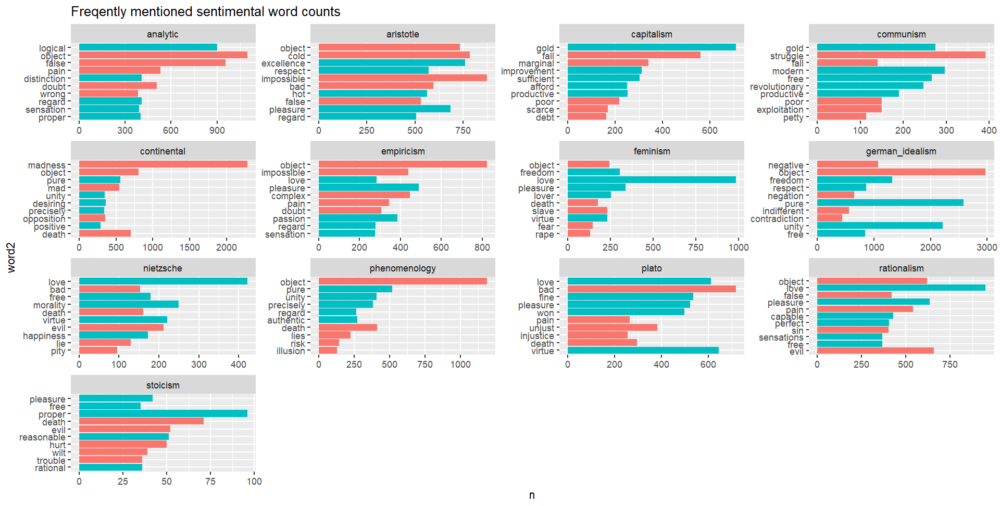
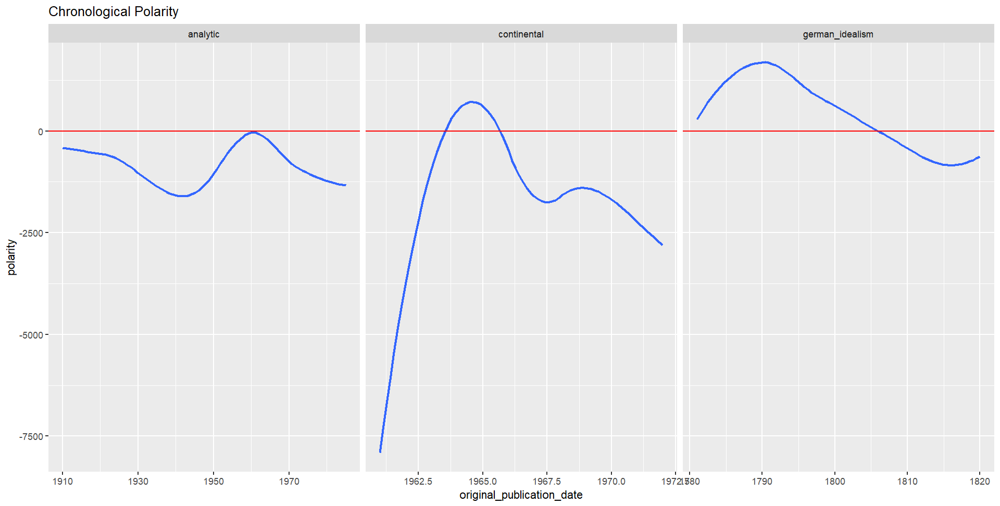
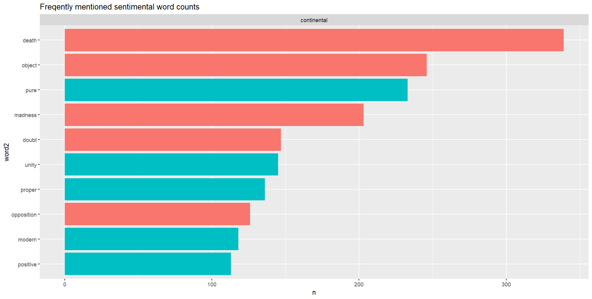
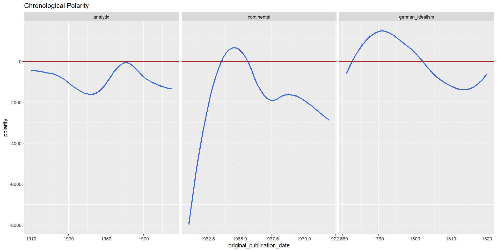

```{r setup, include=FALSE}
knitr::opts_chunk$set(echo = TRUE)
```

# 1. About the Dataset
```{r,include=FALSE}
#load the dataset
philosophy_data <- read.csv("D:/source/Stats 5243/philosophy_data.csv")
```

The philosophy dataset is collected and tidied by the Philosophy Data Project(http://philosophydata.com/index.html). The dataset contains over 300,000 rows of text that is captured from published philosophical works. 59 Works from 13 different philosophy schools are included in this dataset. The names of the 13 schools are listed below.

```{r}
#names of the 13 philosophy schools
levels(factor(philosophy_data$school))
```
This data story tries to discover if any philosophy school carries significantly unbalanced positive or negative emotions, compare to the other schools. And if such schools exist, this data story will be furthered by investigating what topics are these schools discussing about. Furthermore, the data story tries to reveal whether the emotions carried in philosophical works changes over time(the original publication year).

# 2. Data Cleaning and Preprocessing

```{r}
sum(is.null(philosophy_data))
```

I first check the data for any null data. Since the data set is very carefully edited by the Philosophy Data Project contributors, there is no empty value in the data frame. 

I then construct the sub-dataframe from the original philosophy data set. In order to target the analysis on emotion variance between different schools, I eliminate the author and title column and only keep the school column as the 'identity' of each row of data. I then removed the corpus edition date and sentence length since the data analysis will not be investigating relationships related to these factors. The final sub-dataframe that is used in the following data analysis is demonstrated as below.

```{r}
data.frame(index = c(1,2,3),column_names=c("school","original_publication_date","tokenized_txt"),
           column_content=c("The philosophy school the text corresponds to",
                            "The original publication year of the text",
                            "The tokenized text"))
```

# 3. Data Analysis

## 3.1 Emotions for Different Schools

To analyze the emotions for different schools, I first rearrange the data frame so that each row contain only one word from the text and the corresponding school of the text. The data frame expands from 360,0808 words to over 9,000,000 words. However, the tokenized text include several common words that does not carry particular meaning or emotion (eg.'to','the'). Therefore, I filter out these stop words and this step manage to shrink the size of the data frame from over 9.000,000 rows to around 3,000,000 rows. With a concise data frame, it is easier for me to conduct more detailed analysis and infer valueable conclusions.

I utilized the "bing" package to classify the words by sentiment. For example, 'wise' is classified as a positive word and 'corrupted' is classified as a negative word. I then calculated the relative percentage of positive and negative words for each school and generated the following plot.


```{r pressure,out.width="95%",fig.cap="Sentiment Comparison by School"}

```

From Figure.1, I could see that most of the schools have a relatively balanced sentiment distribution with around 45% - 50% of positive words and 50% - 55% of negative words included in their text. However, Continental has a very significant larger proportion of negative emotion compare to the other schools. And Capitalism and German_idealism has a relatively larger proportion of positive emotion compare to the rest of the schools.


## 3.2 Topics for Different Schools

I would then like to investigate what are the schools discussing in their text that result in this difference in emotion distribution. I would first focus on the general topic that the schools are discussing. I count the number of appearance for each word included in the text and sorted for the top 10 most frequently mentioned words.

```{r,echo=FALSE,out.width="95%",fig.cap="Frequently entioned words"}

```
From Fig.2, I could observe that different schools indeed focused on different subjects in their published texts. For example, Capitalism Philosophy main discussion is around labor and production, the top words include "labor", "price" and "trade". On the other hand, Continental Philosophy focuses on broader aspects like nature and time. Hence, it is reasonable to deduce that Capitalism talks more about the positive impacts of introducing reasonable labor thus results in the significant positive emotion proportion, and Continental focus on more neutral and relatively negative aspects regarding nature and results in the larger negative emotion proportion compare to the other philosophy schools.

In order to verify this deduction I filter out words with no clear positive or negative emotional tendency and only plot the sentimental words used for each philosophy school. The result is demonstrated in the following graph.

\pagebreak

```{r,echo=FALSE,out.width="95%",fig.cap="Frequently mentioned sentimental words",fig.pos="h"}

```

In Fig.3, the red bars represent words carrying negative emotion, while green bars represent words with positive emotion. The plot suggests Capitalism Philosophy used words like 'gold' and 'improvement' very frequently, which are very likely to be related to positive impacts of developing trade and various forms of labor. On the contrary, 'madness' is mentioned for over 2000 times in Continental Philosophy, together with 'death' and 'opposition', these words contributed significantly to the negative emotion proportion for Continental school.


## 3.3 Chronological emotion change

I forward my investigation of sentimental text for different philosophy schools on the chronological aspect. I am interested in whether the philosophers from different schools changes their attitudes as time passes.Since some of the schools contain only text from one original published year (e.g. Plato,-350), I choose to focus on Analytic,German_idealism and Continental Philosophy because they have more text from different years.

For each school, I first count the number of positive and negative words for each year and then calculate a polarity score using positive word count minus the negative word count. A positive result suggests the school used more positive words in their published work of that year, while a negative result suggests the school using more negative words. I then create a chronological plot for each of the three schools. 

\pagebreak

```{r,echo=FALSE,out.width="95%",fig.cap="Frequently entioned words",fig.pos="ht"}

```

From the plot, I observe that Analytic and German_idealism has relatively stable polarity. There are some fluctuations over the years but the difference is less than 1000 sentimental words. However, Continental Philosophy has a sharp increase of positive text around 1965. So I decided to conduct further analysis to check whether this sharp increase is caused by any particular word.

I filter for texts belonging to Continental Philosophy from 1963 to 1967 and count the frequency of sentimental words. The following bar chart is generated. 


```{r,echo=FALSE,out.width="85%",fig.cap="Frequently entioned words"}

```

Among the top 5 most frequently mentioned positive words, 'pure' appears to be a possible ambiguous word. For example, 'pure evil' does not carry any positive meaning. Therefore, I removed the word 'pure' from the Continental texts and plot the polarity again.

\pagebreak

```{r,echo=FALSE,out.width="95%",fig.cap="Frequently entioned words"}

```
The resulting plot demonstrates that the word 'pure' along does not contribute significantly to the change of Continental polarity. This shift from negative to positive is more likely to be caused by the increase in positive words in published text as a whole.

# 4. Conclusion and Limitations
From the data analysis I conducted on the philosophy data, I conclude that Continental Philosophy is more negative compare to the other schools while Capitalism and German_idealism are relatively more positive in their published texts. Moreover, the attitudes of philosophers from Analytic and German_idealism Philosophy does does vary significantly over the years, while the attitudes of Continental Philosophy changed from negative to positive very sharply around 1965 and then fall back to negative around 1967.

There are some limitations in my data analysis. Firstly, the text collected may not be the complete work for each school. So many influential texts may not be included in this data set. Secondly, the 'bing' package I used to classify words contain only certain common words, some text that carry positive or negative meaning, especially in the philosophical area, may not be included in the package. Lastly, assign emotion tendency to words may not be the best way to analyze sentences since sentences may be more complex with different figure of speech. Hence, sentences need to be viewed more closely in order to make correct interpretations.


